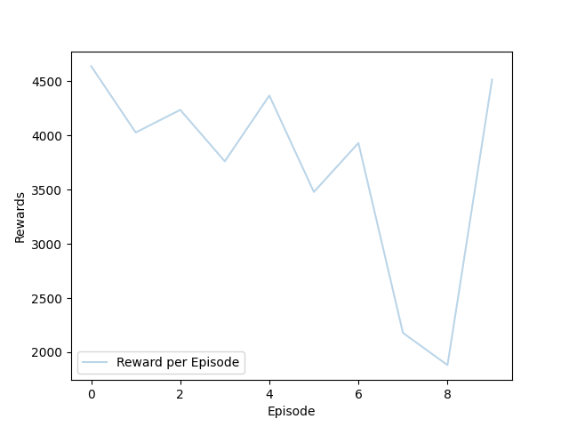

# 🎮 DQN Mario Game - Reinforcement Learning Project

A **Deep Q-Network (DQN)** implementation for training an agent to navigate grid-based environments using reinforcement learning. Built with PyTorch and Pygame.



## 🎯 Project Overview

This project implements a DQN agent that learns to play a Mario-themed grid game. The agent must:
- Navigate from start to goal
- Collect food for bonus rewards
- Avoid bombs (obstacles) and radiators (hell states)
- Learn optimal paths through experience

## 🧠 What is Deep Q-Learning?

**Q-Learning** is a reinforcement learning algorithm that learns the optimal action-value function Q(s,a) - the expected reward for taking action `a` in state `s`.

**Deep Q-Network (DQN)** uses a neural network to approximate Q-values, enabling learning in large state spaces.

### Key Components:
1. **Q-Network**: Neural network that predicts Q-values for all actions
2. **Target Network**: Stabilizes training by providing fixed targets
3. **Experience Replay**: Stores past experiences and samples randomly for training
4. **Epsilon-Greedy**: Balances exploration vs exploitation

## 🗂️ Project Structure

```
├── DQN_model.py       # Neural network architecture
├── utils.py           # Replay buffer & training function
├── main.py            # Training script for 6x6 environment
├── main_dhm1382.py    # Training script for 9x9 environment
├── padm_env.py        # 6x6 grid environment
├── env_dhm1382.py     # 9x9 Super Mario environment
├── Photos/            # Game images (Mario, Goal, Bomb, etc.)
├── dqn.pth            # Trained model weights (6x6)
├── dqn_dhm1382.pth    # Trained model weights (9x9)
└── training_curve.png # Training results visualization
```

## 🎲 Environments

### Environment 1: Simple Grid (6x6)
- **Grid Size**: 6×6
- **Start**: (0, 0)
- **Goal**: (5, 5)
- **Obstacles**: Bombs at various positions
- **Rewards**: Goal (+100), Bomb (-50), Step (-0.1), Food (+10)

### Environment 2: Super Mario (9x9)
- **Grid Size**: 9×9
- **Start**: (1, 0)
- **Goal**: (7, 8)
- **Features**: Walls, obstacles, hell states, food power-ups
- **Super Mario Mode**: Collecting food transforms Mario!
- **Rewards**: Goal (+10), Hell (-5), Obstacle (-5), Step (+1), Food (+5)

## 🧩 Design Decisions: Two Environments

This project intentionally uses **two different grid-world environments**, each designed for a specific purpose.

### 🔹 1. 9×9 Super Mario Environment (Manual Agent)

The **9×9 environment** is the full-featured Super Mario grid world and includes:
- Walls that restrict movement
- Bombs (obstacles)
- Hell states (terminal failure)
- Food power-ups (Mario → Super Mario)
- Pygame-based visual rendering

📌 **Purpose**  
This environment is primarily used for:
- Manual control and visualization
- Verifying environment dynamics
- Debugging reward logic and state transitions
- Demonstrating correct behavior step-by-step

Because rendering is enabled at every step, this environment is **not ideal for fast learning**, but it is excellent for **human validation and explanation**.

---

### 🔹 2. 6×6 Simplified Environment (Q-Learning / DQN)

The **6×6 environment** is a simplified version of the grid world and is used for training the learning agent.

Key simplifications:
- Smaller grid size
- Fewer obstacles
- No complex wall structures
- Minimal or no rendering during training

📌 **Reason for Simplification**  
Rendering the environment at every time step significantly slows down the learning process and negatively affects exploration and exploitation.  
To ensure efficient training, the learning agent is trained in a **simpler, faster environment**.

This allows the agent to:
- Explore more episodes in less time
- Converge faster to an optimal policy
- Focus on learning decision-making rather than visualization

---

### 🧠 Key Insight

The **same learning logic** is used for both environments, but:
- The **9×9 grid** is used for demonstration and validation
- The **6×6 grid** is used for efficient reinforcement learning

This separation improves both **clarity** and **training performance**.
## 🚀 How to Run

### Prerequisites
```bash
pip install torch gymnasium pygame numpy matplotlib
```

### Training
```bash
# Train on 6x6 environment
python main.py

# Train on 9x9 Super Mario environment
python main_dhm1382.py
```

### Play Manually (9x9 Environment)
```bash
python env_dhm1382.py
```
Use arrow keys to control Mario!

### Test Trained Model
Set `test_dqn = True` and `train_dqn = False` in the main files.

## 📊 Training Results

The agent learns to navigate efficiently over ~3000 episodes:
- **Early Training**: Random exploration, negative rewards
- **Mid Training**: Starts finding goal occasionally
- **Late Training**: Consistently reaches goal efficiently

## 🧪 Hyperparameters

| Parameter | Value |
|-----------|-------|
| Learning Rate | 0.01 |
| Gamma (Discount) | 0.98 |
| Buffer Size | 50,000 |
| Batch Size | 32 |
| Epsilon Decay | 1.0 → 0.01 |

## 🔧 Key Implementation Details

### Neural Network (DQN_model.py)
```python
Input(2) → Linear(128) → ReLU → Linear(128) → ReLU → Linear(4)
```
- Input: 2D state (x, y coordinates)
- Output: Q-values for 4 actions (Up, Down, Right, Left)

### Epsilon-Greedy Exploration
```python
epsilon = max(0.01, 1 - 0.99*(episode/total_episodes))
```
Starts with 100% exploration, decays to 1% over training.

### Experience Replay
Stores (state, action, reward, next_state, done) tuples and samples randomly to break correlation between consecutive samples.

## 📝 Author

Created for **Principles of Autonomy and Decision Making** course at THI.

## 📄 License

This project is for educational purposes.
